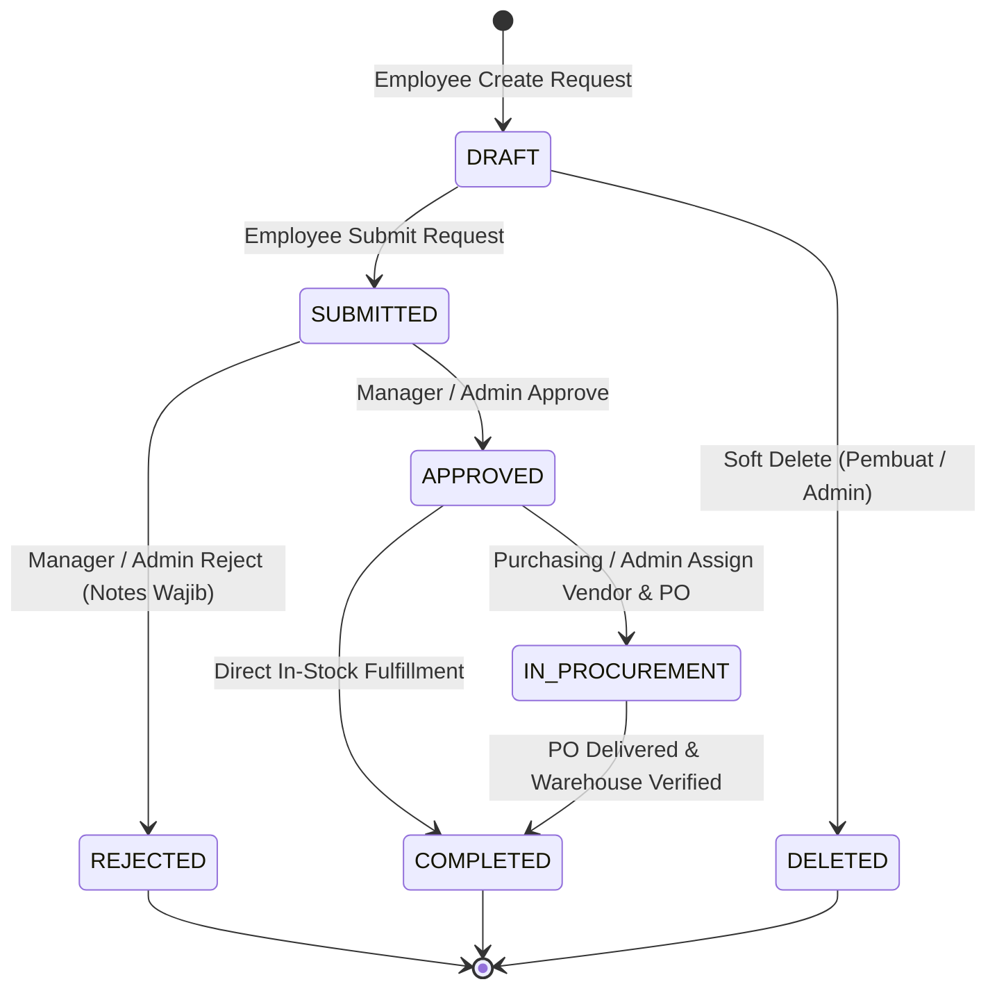
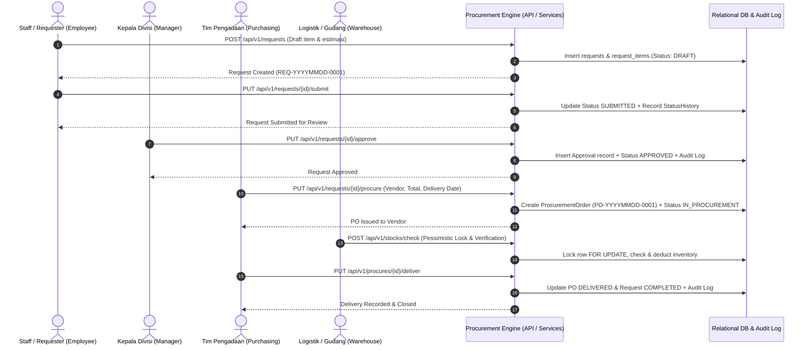

# 🏢 Enterprise Procurement Management API

[](https://laravel.com)
[](https://php.net)
[](https://mysql.com)
[](https://laravel.com/docs/sanctum)
[](https://en.wikipedia.org/wiki/Finite-state_machine)
[](#-immutable-audit-trail--compliance)

> **Enterprise-Grade RESTful API** untuk otomasi tata kelola pengadaan barang/jasa (*End-to-End Procurement Lifecycle*), dirancang dengan standar keandalan tinggi, *Segregation of Duties (SoD)*, *Finite State Machine (FSM)*, *Pessimistic Locking* untuk pencegahan *race condition*, serta *Audit Trail* yang *immutable*.

---

## 📌 Executive Summary

Dalam ekosistem korporasi skala besar, BUMN, dan BUMD, proses pengadaan barang dan jasa (*procurement*) merupakan lini operasi krusial yang menuntut **transparansi mutlak, akuntabilitas audit, pencegahan fraud, dan efisiensi anggaran**.

Repository ini menyajikan solusi backend modern yang mengabstraksi seluruh siklus pengadaan:
1. **Perencanaan Kebutuhan (Requisition)** oleh unit kerja/divisi.
2. **Pemeriksaan Stok Real-time (Warehouse Inventory Check)** dengan mekanisme *concurrency lock*.
3. **Persetujuan Bertingkat (Multi-Stage Approval Hierarchy)** oleh manajemen.
4. **Penerbitan Kontrak / Purchase Order (PO)** ke mitra rekanan (*vendor*).
5. **Penerimaan Logistik & Verifikasi (Delivery & Fulfillment)**.
6. **Pelaporan Eksekutif & Analisis Lead Time (Business Intelligence)**.

---

## 🎯 Keselarasan Standar Industri & Tata Kelola Enterprise

Sistem ini dirancang untuk memenuhi standar kepatuhan regulasi, skalabilitas perangkat lunak tingkat korporasi, serta prinsip *Good Corporate Governance (GCG)* lintas sektor industri:

| Domain Industri | Kebutuhan Utama Tata Kelola | Solusi Teknis dalam Arsitektur Ini |
|---|---|---|
| **Mission-Critical & Regulated Infrastructure** *(Aviation, Energy, Transportation)* | Menuntut kepatuhan audit ketat, *zero-tolerance* terhadap manipulasi pengadaan suku cadang vital, serta alur otorisasi multi-level yang tidak dapat di-*bypass*. | • **Immutable Audit Trail**: Setiap perubahan status mencatat identitas aktor, stempel waktu, IP address, dan User-Agent tanpa izin edit/hapus.<br>• **Strict Finite State Machine**: Menjamin alur persetujuan berjalan deterministik sesuai SOP.<br>• **Chronological Serial Numbering**: Generator kode otomatis `REQ-YYYYMMDD-XXXX` dan `PO-YYYYMMDD-XXXX`. |
| **Enterprise IT & Managed Services** *(Systems Integration, Cloud & Data Center)* | Membutuhkan arsitektur bersih, *concurrency safe*, pencegahan *race condition* saat transaksi simultan tinggi, dan kemudahan integrasi API. | • **Service Layer Architecture**: Pemisahan jelas antara HTTP Transport, Form Request Validation, dan Business Domain.<br>• **Pessimistic Concurrency Control**: Penerapan `SELECT ... FOR UPDATE` dan transaksi atomik `DB::transaction` pada mutasi inventaris.<br>• **UUIDv4 Identity**: Melindungi sistem dari kerentanan *ID Enumeration* / IDOR.<br>• **High-Performance Aggregation**: Kueri analitik berbasis SQL native untuk metrik performa real-time. |
| **Public Utilities & Regional Logistics** *(Water Utilities, Municipal Asset Procurement)* | Membutuhkan transparansi pengelolaan anggaran publik, pemantauan batas stok material operasional, dan evaluasi ketepatan waktu vendor. | • **Inventory Threshold Alerts**: Monitoring kuantitas stok gudang dengan *minimum stock alert* untuk mencegah keterlambatan suplai material.<br>• **Vendor Management & Lifecycle**: Standardisasi katalog mitra rekanan terverifikasi.<br>• **Procurement Lead Time Analytics**: Menghitung metrik SLA rata-rata, tercepat, dan terlama dari pengajuan hingga barang tiba di gudang. |

---

## 🏗 Enterprise Architecture & Design Patterns

Aplikasi mengadopsi prinsip **Clean Architecture** dan **Domain Separation** berbasis Service Layer:

```
procurement-api/
├── app/
│   ├── Exceptions/
│   │   └── BussinessException.php      # Domain Exception untuk pelanggaran aturan bisnis (HTTP 422)
│   ├── Helpers/
│   │   ├── GeneratePoNumber.php        # Generator nomor PO terurut otomatis (PO-YYYYMMDD-XXXX)
│   │   ├── GenerateReqNumber.php       # Generator nomor Request terurut otomatis (REQ-YYYYMMDD-XXXX)
│   │   └── ResponseFormatter.php       # Standarisasi JSON envelope (meta: code, status, message; result)
│   ├── Http/
│   │   ├── Controllers/API/            # Transport Layer (Handling HTTP Request, delegasi ke Service)
│   │   │   ├── AuthController.php
│   │   │   ├── DepartmentController.php
│   │   │   ├── ProcurementController.php
│   │   │   ├── ReportController.php
│   │   │   ├── RequestController.php
│   │   │   ├── StockController.php
│   │   │   ├── UserController.php
│   │   │   └── VendorController.php
│   │   ├── Middleware/
│   │   │   └── RoleMiddleware.php      # Granular Role-Based Access Guard
│   │   └── Requests/                   # Validation Layer (Type casting & custom validation rules)
│   ├── Models/                         # Data Layer (Eloquent ORM, FSM definition, UUID, SoftDeletes)
│   │   ├── Approval.php
│   │   ├── Department.php
│   │   ├── ProcurementOrder.php
│   │   ├── ProcurementRequest.php
│   │   ├── RequestItem.php
│   │   ├── StatusHistory.php           # Immutable Audit Model (delete & update di-override exception)
│   │   ├── Stock.php
│   │   ├── User.php
│   │   └── Vendor.php
│   └── Services/                       # Business Logic Layer (Transaksi database, State validation)
│       ├── AuthService.php
│       ├── ProcureService.php
│       ├── ReportService.php
│       ├── RequestService.php
│       └── StockService.php
├── database/
│   ├── migrations/                     # DDL Skema Relasional, Foreign Key Constraints & Multi-column Indexing
│   └── seeders/                        # Seed data multi-divisi dan multi-role untuk simulasi instan
└── routes/
    └── api.php                         # Routing API v1 dengan pengelompokan middleware Sanctum & Role
```

---

## 🔄 Alur Bisnis & Finite State Machine (FSM)

Sistem pengadaan menerapkan **State Machine** deterministik untuk menjamin tidak ada satupun pesanan yang melompati tahapan audit.

### 1. Diagram Transisi Status Pengadaan (Procurement Request FSM)



### 2. Diagram Urutan Proses Antar-Aktor (Sequence Flow)



---

## 🔐 Matriks Hak Akses & Peran (Role-Based Access Control)

Sistem membagi operasional menjadi **5 peran spesifik** demi menegakkan prinsip *Segregation of Duties (SoD)*:

| Modul & Fungsionalitas | `employee` | `manager` | `purchasing` | `warehouse` | `admin` |
|---|:---:|:---:|:---:|:---:|:---:|
| **Autentikasi & Profile (`/auth/*`)** | ✅ | ✅ | ✅ | ✅ | ✅ |
| **Buat & Edit Draft Request Sendiri** | ✅ | ✅ | ✅ | ✅ | ✅ |
| **Submit Request Milik Sendiri** | ✅ | ✅ | ✅ | ✅ | ✅ |
| **Melihat Daftar Pengadaan (Scope Filter)** | Milik Sendiri | Semua Divisi | Semua Divisi | Semua Divisi | Semua Divisi |
| **Approve / Reject Permohonan Pengadaan** | ❌ | ✅ | ❌ | ❌ | ✅ |
| **Penerbitan PO & Assign Vendor (`procure`)** | ❌ | ❌ | ✅ | ❌ | ✅ |
| **Penyelesaian PO (`deliver` & `complete`)** | ❌ | ❌ | ✅ | ❌ | ✅ |
| **Cek Ketersediaan Stok (`lockForUpdate`)** | ✅ | ✅ | ✅ | ✅ | ✅ |
| **Input / Update Master Stok Gudang** | ❌ | ❌ | ❌ | ✅ | ✅ |
| **Kelola Master Vendor & Rekanan** | ❌ | ❌ | ✅ | ❌ | ✅ |
| **Kelola Master Departemen & Pengguna** | ❌ | ❌ | ❌ | ❌ | ✅ |
| **Akses Laporan Analitik & KPI Dashboard** | ❌ | ✅ | ❌ | ❌ | ✅ |

---

## 🛡️ Keunggulan Rekayasa Perangkat Lunak (Engineering Highlights)

### 1. 📜 Immutable Audit Trail & Regulatory Compliance
Setiap perubahan status tersimpan di tabel `status_histories`. Model `StatusHistory` menerapkan proteksi ketat pada tingkat kode:
* Timestamp transaksi tersimpan otomatis (*append-only*).
* Menangkap `request_id`, `changed_by`, `from_status`, `to_status`, `notes`, serta jejak digital jaringan: `ip_address` dan `user_agent`.
* Metode `delete()` dan `update()` pada model sengaja di-*override* untuk **melempar exception**, memastikan bukti audit tidak dapat dimanipulasi (*anti-tampering*).

### 2. ⚡ Penanganan Konkurensi & Race Condition (*Pessimistic Locking*)
Ketika banyak operator gudang memeriksa atau mengambil alokasi stok material berbarengan, sistem mengisolasi record menggunakan `lockForUpdate()` di dalam transaksi atomik:
```php
DB::transaction(function () use ($itemName, $requiredQty) {
    $stock = Stock::where('item_name', 'like', '%' . $itemName . '%')
        ->lockForUpdate() // SELECT ... FOR UPDATE (Mencegah double-allocation)
        ->first();

    if ($stock && $stock->isAvailable($requiredQty)) {
        $stock->decrement('quantity', $requiredQty);
    }
    // ...
});
```

### 3. 🔑 Proteksi Enumerasi Identitas (UUIDv4)
Seluruh tabel transaksi dan master menggunakan *Universally Unique Identifier* (UUIDv4 / 36-karakter string), menghilangkan kerentanan *ID Enumeration* / *Insecure Direct Object References (IDOR)* yang sering ditemukan pada ID integer incremental biasa.

### 4. 📊 Kueri Analitik & Business Intelligence
Sistem menyediakan endpoint intelijen bisnis yang dioptimasi pada level basis data:
* **`averageLeadTime`**: Menghitung rata-rata, waktu tercepat, dan waktu terlama proses pengadaan dari status `SUBMITTED` hingga `COMPLETED` menggunakan subkueri `TIMESTAMPDIFF(DAY, ...)`.
* **`categoryPerMonth`**: Agregasi tren belanja per kategori barang bulanan (`DATE_FORMAT`).
* **`topDepartments`**: Menampilkan 5 departemen paling aktif mengajukan permohonan dalam 3 bulan terakhir (`DATE_SUB(NOW(), INTERVAL 3 MONTH)`).

---

## 📚 Dokumentasi Endpoint API

**Base URL:** `http://localhost:8000/api/v1`  
Semua endpoint terproteksi memerlukan header:
```http
Authorization: Bearer <your_access_token>
Accept: application/json
```

### Format Standar Respon (Envelope Pattern)
```json
{
  "meta": {
    "code": 200,
    "status": "success",
    "message": "Data request retrieved."
  },
  "result": { ... }
}
```

---

### 1. Autentikasi (`/auth`)

| Metode | Endpoint | Akses | Keterangan |
|---|---|---|---|
| `POST` | `/auth/login` | Publik | Autentikasi kredensial & penerbitan Bearer Token |
| `POST` | `/auth/register` | Publik | Pendaftaran pengguna baru |
| `POST` | `/auth/logout` | 🔒 Terautentikasi | Pencabutan token sesi aktif |
| `GET` | `/auth/me` | 🔒 Terautentikasi | Profil akun yang sedang login beserta data departemen |

<details>
<summary><b>Contoh Request & Response Login</b></summary>

**Payload Request:**
```json
{
  "email": "employee@procurement.app",
  "password": "password"
}
```

**Respon Sukses (200 OK):**
```json
{
  "meta": {
    "code": 200,
    "status": "success",
    "message": "login berhasil"
  },
  "result": {
    "access_token": "1|qXy...random_sanctum_token...",
    "token_type": "Bearer",
    "user": {
      "id": "019e1304-e3c3-731d-b5c2-2a2c1be46252",
      "name": "Budi Santoso",
      "email": "employee@procurement.app",
      "role": "employee",
      "department": {
        "id": "019e1304-e3c0-731d-b5c2-2a2c1be46251",
        "name": "Finance",
        "code": "FIN"
      }
    }
  }
}
```
</details>

---

### 2. Permohonan Pengadaan (`/requests`)

| Metode | Endpoint | Akses | Keterangan |
|---|---|---|---|
| `GET` | `/requests` | 🔒 Terautentikasi | Daftar pengadaan (disaring otomatis per peran & query filter) |
| `POST` | `/requests` | 🔒 Terautentikasi | Pembuatan draf pengadaan baru beserta daftar item (*batch*) |
| `PUT` | `/requests/{id}` | 🔒 Terautentikasi | Pembaharuan catatan pengadaan (hanya status `DRAFT`) |
| `DELETE` | `/requests/{id}` | 🔒 Terautentikasi | Pembatalan draf (hanya status `DRAFT`) |
| `PUT` | `/requests/{id}/submit` | 🔒 Terautentikasi | Mengajukan draf untuk ditinjau (`DRAFT` → `SUBMITTED`) |
| `PUT` | `/requests/{id}/approve` | 🔒 Manager, Admin | Menyetujui pengadaan (`SUBMITTED` → `APPROVED`) |
| `PUT` | `/requests/{id}/reject` | 🔒 Manager, Admin | Menolak pengadaan beserta alasan penolakan |
| `PUT` | `/requests/{id}/procure` | 🔒 Purchasing, Admin | Menerbitkan PO ke vendor (`APPROVED` → `IN_PROCUREMENT`) |
| `PUT` | `/requests/{id}/complete`| 🔒 Purchasing, Admin | Menutup pengadaan (`IN_PROCUREMENT` → `COMPLETED`) |

<details>
<summary><b>Contoh Payload Pembuatan Pengadaan Multi-Item</b></summary>

```json
{
  "notes": "Pengadaan suku cadang perangkat telekomunikasi navigasi darurat",
  "items": [
    {
      "item_name": "Switch Cisco Catalyst 24-Port",
      "category": "Electronics",
      "quantity": 2,
      "unit": "unit",
      "estimated_price": 18500000,
      "notes": "Spesifikasi rackmount untuk data center cabang"
    },
    {
      "item_name": "Kabel UTP Cat6 305m",
      "category": "Office Equipment",
      "quantity": 3,
      "unit": "roll",
      "estimated_price": 1750000,
      "notes": "Roll kabel bersertifikat ISO"
    }
  ]
}
```
</details>

<details>
<summary><b>Contoh Payload Penerbitan Purchase Order (Procure)</b></summary>

```json
{
  "vendor_id": "019e1304-e7ba-73a2-820d-693700020831",
  "expected_delivery_date": "2026-06-15",
  "total_amount": 42250000,
  "notes": "Pengiriman langsung ke Workshop Logistik Bagian Barat"
}
```
</details>

---

### 3. Purchase Order & Logistik (`/procures`)

| Metode | Endpoint | Akses | Keterangan |
|---|---|---|---|
| `GET` | `/procures` | 🔒 Purchasing, Admin | Melihat seluruh Purchase Order beserta vendor & status |
| `PUT` | `/procures/{id}/deliver` | 🔒 Purchasing, Admin | Konfirmasi penerimaan barang & otomasi penutupan request |

---

### 4. Manajemen Stok & Pergudangan (`/stocks`)

| Metode | Endpoint | Akses | Keterangan |
|---|---|---|---|
| `GET` | `/stocks` | 🔒 Terautentikasi | Katalog stok barang dengan filter kategori & nama |
| `GET` | `/stocks/{id}` | 🔒 Terautentikasi | Detail stok item |
| `POST` | `/stocks` | 🔒 Warehouse, Admin | Registrasi material/stok baru |
| `PUT` | `/stocks/{id}` | 🔒 Warehouse, Admin | Penyesuaian informasi/jumlah stok |
| `POST` | `/stocks/check` | 🔒 Terautentikasi | Validasi ketersediaan barang dengan *Pessimistic Lock* |

---

### 5. Mitra Rekanan / Vendor (`/vendors`)

| Metode | Endpoint | Akses | Keterangan |
|---|---|---|---|
| `GET` | `/vendors` | 🔒 Terautentikasi | Daftar vendor berstatus aktif beserta kategori layanan |
| `GET` | `/vendors/{id}` | 🔒 Terautentikasi | Rincian profil rekanan |
| `POST` | `/vendors` | 🔒 Purchasing, Admin | Registrasi vendor rekanan baru |
| `PUT` | `/vendors/{id}` | 🔒 Purchasing, Admin | Update legalitas/kontak vendor |
| `DELETE` | `/vendors/{id}` | 🔒 Purchasing, Admin | Nonaktifkan / hapus vendor |

---

### 6. Departemen & Organisasi (`/departments`)

| Metode | Endpoint | Akses | Keterangan |
|---|---|---|---|
| `GET` | `/departments` | 🔒 Terautentikasi | Daftar departemen beserta relasi pengguna |
| `GET` | `/departments/{id}` | 🔒 Terautentikasi | Detail unit departemen |
| `POST` | `/departments` | 🔒 Admin | Tambah struktur departemen baru |
| `PUT` | `/departments/{id}` | 🔒 Admin | Edit kode atau nama departemen |
| `DELETE` | `/departments/{id}` | 🔒 Admin | Hapus departemen |

---

### 7. Manajemen Pengguna (`/users`)

| Metode | Endpoint | Akses | Keterangan |
|---|---|---|---|
| `GET` | `/users` | 🔒 Admin | Daftar seluruh karyawan & hak akses |
| `GET` | `/users/{id}` | 🔒 Admin | Detail spesifik karyawan |
| `POST` | `/users` | 🔒 Admin | Pembuatan akun baru dengan penetapan role |
| `PUT` | `/users/{id}` | 🔒 Admin | Modifikasi profil karyawan (dilindungi dari modifikasi akun sendiri) |
| `PATCH` | `/users/{id}/role` | 🔒 Admin | Mengubah role jabatan |
| `DELETE` | `/users/{id}` | 🔒 Admin | Hapus pengguna & cabut seluruh token aktif |

---

### 8. Laporan & Intelijen Bisnis (`/reports`)

| Metode | Endpoint | Akses | Keterangan |
|---|---|---|---|
| `GET` | `/reports/summary` | 🔒 Manager, Admin | Ringkasan metrik eksekutif (total permohonan, antrean approval, vendor aktif) |
| `GET` | `/reports/top-departments` | 🔒 Manager, Admin | 5 departemen dengan pengajuan terbanyak dalam 3 bulan terakhir |
| `GET` | `/reports/category-per-month` | 🔒 Manager, Admin | Distribusi volume dan frekuensi belanja per kategori per bulan |
| `GET` | `/reports/average-lead-time` | 🔒 Manager, Admin | Metrik SLA rata-rata, tercepat, dan terlama pengadaan (hari) |

---

## 🗄️ Relasi Basis Data & Integritas Skema

```
[departments] ──< [users] ──< [requests] ──< [request_items]
                             ├──< [approvals]
                             ├──< [status_histories] (Immutable Log)
                             └──< [procurement_orders] >── [vendors]
[stocks]
```

* **Foreign Key Constraints**: Menggunakan aturan `restrictOnDelete()` pada seluruh relasi inti untuk mencegah hilangnya riwayat historis pengadaan jika entitas master dihapus secara tidak sengaja.
* **Soft Deletes**: Diterapkan pada data transaksional (`requests`, `request_items`, `procurement_orders`) agar pemulihan data dan penelusuran audit tetap terjaga.
* **Compound Indexing**: Index dipasang pada kolom filter yang sering diakses (`status`, `requester_id`, `department_id`, `created_at`).

---

## 🚀 Panduan Instalasi & Eksekusi Lokal

### Prasyarat Lingkungan
* **PHP** >= 8.2 (dengan ekstensi `pdo_mysql`, `openssl`, `mbstring`, `curl`)
* **Composer** >= 2.x
* **MySQL** >= 8.0
* **Git**

### Langkah-Langkah Setup

```bash
# 1. Kloning repository
git clone https://github.com/Azzasafah/procurement-api.git
cd procurement-api

# 2. Instal dependensi PHP via Composer
composer install

# 3. Siapkan file konfigurasi lingkungan
cp .env.example .env

# 4. Generate Application Encryption Key
php artisan key:generate

# 5. Konfigurasi kredensial basis data pada file .env
# DB_CONNECTION=mysql
# DB_HOST=127.0.0.1
# DB_PORT=3306
# DB_DATABASE=procurement_db
# DB_USERNAME=root
# DB_PASSWORD=your_password

# 6. Jalankan migrasi tabel
php artisan migrate

# 7. Isi data awal (departemen, akun multi-role, vendor sampel, stok awal)
php artisan db:seed

# 8. Hubungkan storage symlink (jika menggunakan fitur foto profil)
php artisan storage:link

# 9. Jalankan server lokal
php artisan serve
```

Server API akan aktif dan siap menerima request pada: `http://localhost:8000`.

---

## 👥 Akun Simulasi & Pengujian Bawaan (Seeders)

Semua akun pengujian di bawah ini dibuat otomatis saat menjalankan `php artisan db:seed` dengan kata sandi universal: `password`.

| Peran | Nama Pengguna | Alamat Email | Departemen | Lingkup Tugas Pengujian |
|---|---|---|---|---|
| **Admin** | Admin System | `admin@procurement.app` | Information Technology | Manajemen pengguna, role, dan konfigurasi master |
| **Employee** | Budi Santoso | `employee@procurement.app` | Finance | Pengajuan draf kebutuhan barang operasional kantor |
| **Manager** | Andi Wijaya | `manager@procurement.app` | Information Technology | Verifikasi & persetujuan/penolakan permohonan divisi |
| **Purchasing** | Siti Rahayu | `purchasing@procurement.app` | Information Technology | Negosiasi vendor, penerbitan PO, dan penyelesaian order |
| **Warehouse** | Dewi Lestari | `warehouse@procurement.app` | Operations | Validasi kuantitas stok gudang & penerimaan material |

---

## 🧪 Koleksi Pengujian API (Postman)

Koleksi Postman siap pakai telah disediakan untuk mempermudah evaluasi pengujian menyeluruh:
* Menguji alur otorisasi *Bearer Token*.
* Menguji siklus hidup lengkap pengadaan dari status *Draft* hingga *Completed*.
* Menguji skenario negatif (*Unauthorized access*, *Invalid status transitions*, *Forbidden role actions*).

---

## 👨‍💻 Profil Pengembang

**Muhammad Hafizh Azzasafah**  
*Fullstack & Backend Engineer*  
- 💼 LinkedIn: [linkedin.com/in/muhammad-hafizh-azzasafah](https://www.linkedin.com/in/muhammad-hafizh-azzasafah/)
- 🐙 GitHub: [github.com/Azzasafah](https://github.com/Azzasafah)
- 📧 Email: [muhammad.hafizh0408@gmail.com](mailto:muhammad.hafizh0408@gmail.com)

---

## 📄 Lisensi

Proyek ini dilisensikan di bawah lisensi terbuka [MIT License](LICENSE).